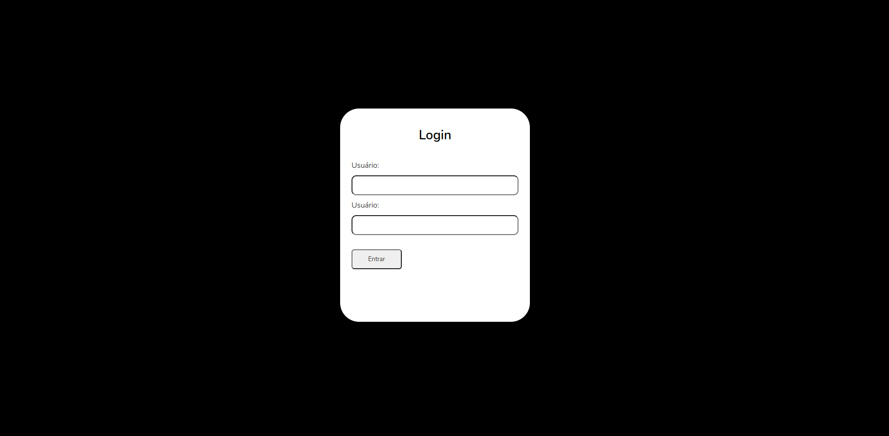
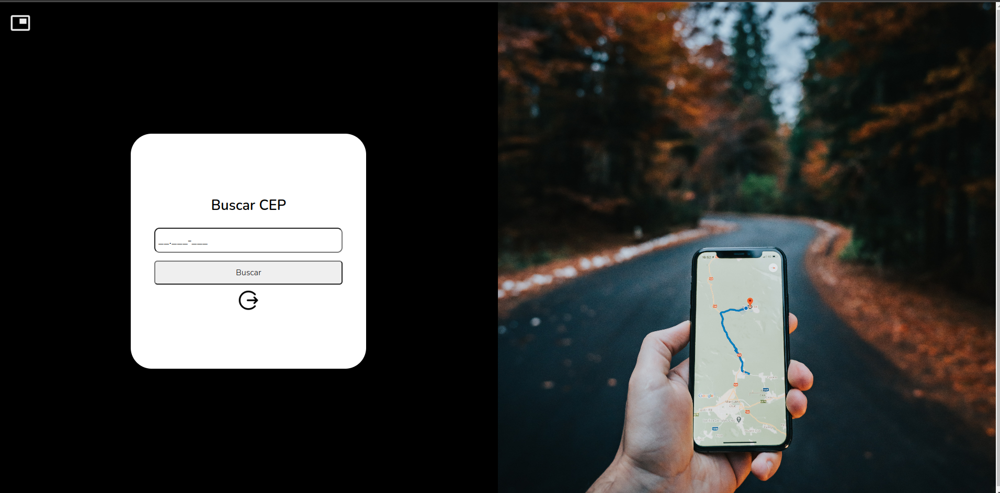
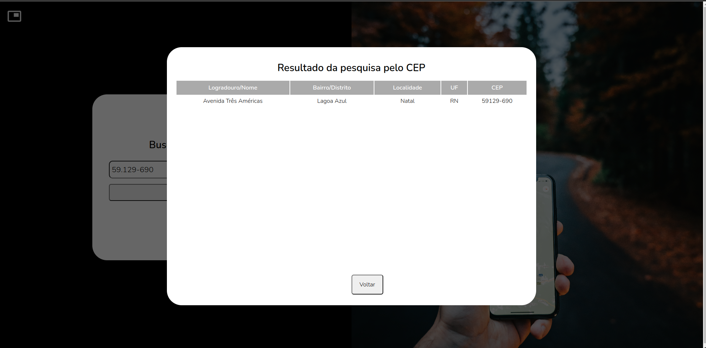
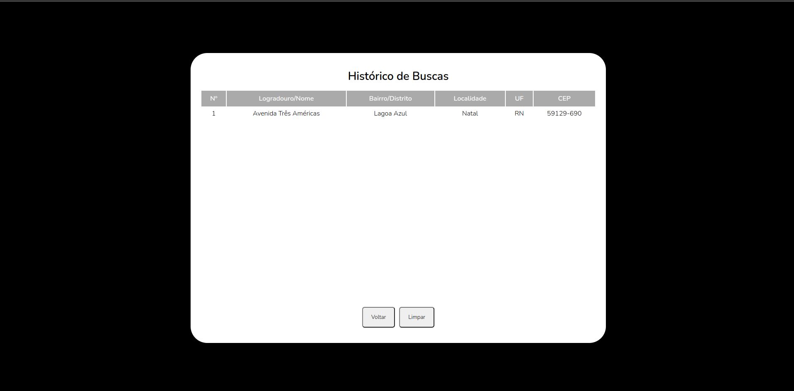

# Projeto CEP - Angular

---

### O que é este projeto?

Este projeto é uma aplicação Angular que busca e retorna o endereço correspondente a um determinado CEP. Como também tem a funcionalidade de guardar os registros de pesquisas.

Além disso:

- A interface é simples e intuitiva, permitindo ao usuário realizar a busca do endereço com facilidade.
- A aplicação utiliza a API de consulta [VIACEP](https://viacep.com.br/) para obter as informações precisas sobre o endereço.
- O histórico de pesquisas é armazenado localmente no navegador do usuário, permitindo acesso rápido às informações já pesquisadas.
- A aplicação é responsiva, adaptando-se a diferentes tamanhos de tela.

### Como usar este projeto?

Na tela de login, insira as credenciais de usuário: "admin" e senha: "1234" para acessar a tela de busca.

Já na tela de busca, insira o cep que deseja procurar e click no botão "buscar" e será apresentado um modal com o resultado.

Caso deseje consultar as buscas realizaads, no canto superior esquerdo haverá um ícone que lhe redirecioná para a tela de registros.

### Como utilizar este projeto?

Para utilizar este projeto, é preciso fazer o download do repositório e uma vez na pasta raís do repositório, você deve rodar o comando `npm install` para fazer a instalação e o comando `ng serve` para executar a aplicação em um terminal.

Isso irá executar servidor de desenvolvimento, e rodará a aplicação em uma das portas da sua máquina, que pode ser acessada através de **<http://localhost:PORTA>** na sua máquina, ou através de  **<http://SEUIP:PORTA>** na rede local. Esses endereços serão exibidos após o programa estar rodando.
